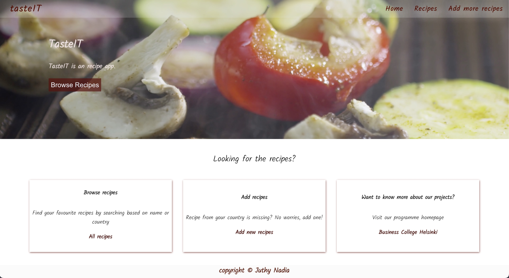

# TasteIT

TasteIT, a recipe app where users from all over the world can share their love for food through browsing and adding their own dishes.



## Technologies used

- React
- JSON server
- Axios
- [restcountries API](https://restcountries.com/)

### Features

- Browse all recipes in the app with detalis : recipe country, ingredients, instructions to make it.
- Add new recipe
- Search any recipe by name or country
- Navigate to different pages through the buttons

## How to run

Clone the repo and set up the project:

In order to run server, run below command

```
npm run server
```

server will start running on port 3007 http://localhost:3007

In order to run client, run below command

```
npm install
npm start 
```

App opens at http://localhost:3000 in browser.